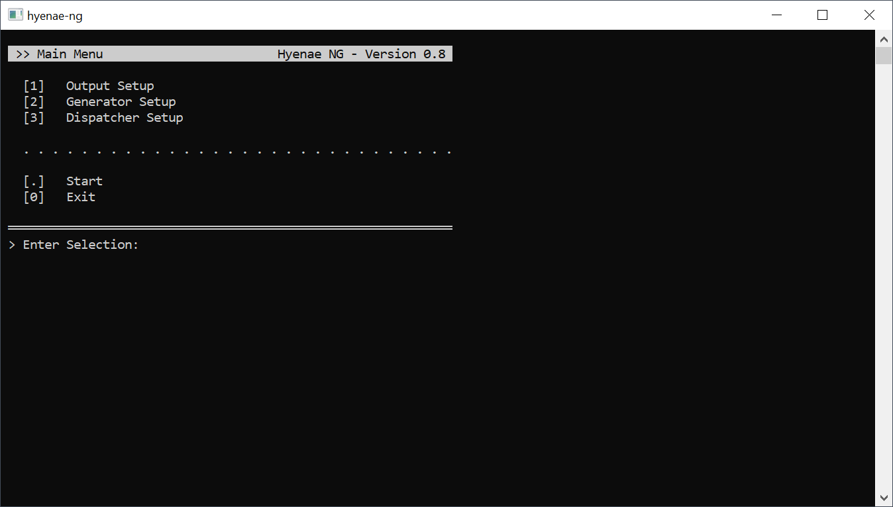
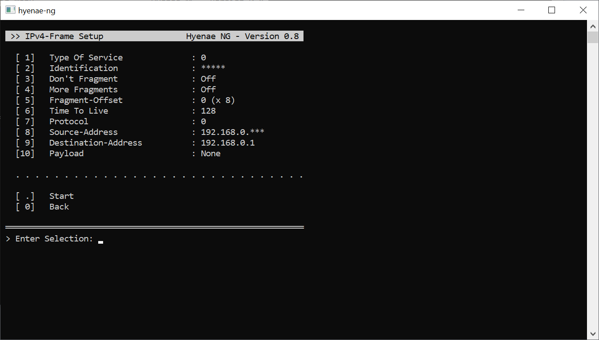
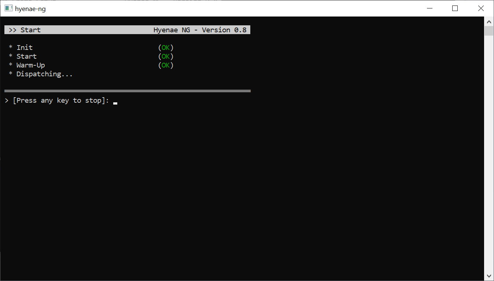

# Hyenae NG

Hyenae NG (Next Generation) is a re-write of the original Hyenae tool which
was originally published back in the year 2010.

Besides switching from C to C++, using modern design concepts, Hyenae NG was
(just like the original Hyenae) written with maximum portability in mind.
Since the original Hyenae had a very complex command line syntax Hyenae NG
comes with a fast and intuitively usable command line menu that will allow
you to effectively set up even complex stress-tests or attacks scenarios
within seconds.

Copyright (C) 2020 Robin Richter

## Features

- Fully customizable and combinable data generators:
  - Ethernet-Layer
  - ARP-Layer
  - IPv4-Layer
  - IPv6-Layer
  - ICMPv4-Layer
  - ICMPv6-Layer
  - TCP-Layer
  - UDP-Layer
  - Text-Buffer
- Fixed or Random Send Delay
- Pattern based address randomization
- Clean and easy to use command line menu (No RTFM'ing required;))
- Platform Independent

## Coverage

- ARP-Request flooding (DoS)
- ARP-Cache poisoning (MITM)
- ICMP-Echo flooding (DoS)
- ICMP-Smurf attack (DoS)
- TCP-SYN flooding (DoS)
- TCP-Land attack (DoS)
- Blind TCP-Connection reset (DoS)
- UDP flooding (DoS)
- and many more...

## Project Goals

The original Hyenae project started out as a study of network stack
implementations but then quickly gained more complex features such as a
remote daemon and an attack asistent. Even if it was widely accepted and is
still a very commonly used tool in todays pen-testing workflows it has a
complex command line syntax and requires some training and research in order
to be used properly.

With Hyenae NG i would like to provide the complexity and felxibility of
Hyenae in a clean and easy to use command line tool which can be instantly
used without any futher research on the command line arguments to pass for
the specific scenarios.

## Contribution

If you like this project and would like to contribute to it (in which way
ever), feel free to do so via my GitHub page or by contacting me directly.
Improvement ideas and bug reports are very welcomed.

## Basic Usage

Once you start Hyenae NG, it will enter the main menu state. From here you can
set up your desired output, generator and dispatcher configuration.

- **Output Setup**\
  The output setup let you choose from several different output option. You
  can either have Hyenae NG's output ignore by selecting "No Output" our you
  can have it send to either a file or a network adapter. Once you have
  selected an output, you can enter it's sub setup by selecting it again by
  either entering it's menu item number again or by simply pressing enter.
  Outputs that have a sub-setup are marked with a (...) once they are
  selected.

- **Generator Setup**\
  The generator setup let you chose from several different generators. Most
  generators provide a payload option for which you can select another
  generator and so on. Since network frame generators are nested in transport
  layers, their available payload generators will differ based on the
  previously chosen frame generator. Here is an example of a typical
  payload nesting for an ethernet packet:

      Ethernet +-> ARP
               |
               +-> IPv4 +-> ICMPv4 -> ICMP Echo Payload
               |        +-> TCP
               |        +-> UDP
               |        +-> ...
               |
               +-> IPv6 +-> ICMPv4 -> ICMP Echo Payload
                        +-> ICMPv6 -> ICMP Echo Payload
                        +-> TCP
                        +-> UPD
                        +-> ...

- **Dispatcher Setup**\
  The dispatcher setup will let you set up the actual data dispatcher. You
  can define stop-limits or configure a fixed or random send delay in order
  to break flood detection mechanisms on your target system.

  **IMPORTANT**\
  It is reccomended to use a fixed send delay of at least 100 ms on low
  spec systems such as the GPD Pocket 2 in order to prevent key-press
  detection issues.

- **Start Dispatcher**\
  Once you have set a generator, you can choose this option to start up the
  dispatcher and start sending packets. If you haven't set a generator yet, 
  an error message will be shown instead. The dispatcher will operate until
  either a stop-limit (if set) is reached or the user presses any key. After
  the dispatcher has stopped you can either return to the main menu by
  entering 0 or start it again by either entering 1 or simply pressing enter.

## Generator Patterns

A lot of packet generator parameters such as for address-, port- and number-
fields can be providing with a generator pattern. These patterns will be used
in order to generate a new value on every new packet. Here are some examples
of a few basic patterns:

- Random 5-digit number: 
  `*****`
 
- Incremental 3-digit number: 
   `+++`

- Decremental 2-digit number: 
   `--`

- Random number between `100` and `190`: 
   `1*0`

- Incremental number from `1` to `991`: 
   `++1`

- Decremental number from `299` to `200`: 
   `2--`

- Random IPv4 address between `.200` and `.255`: 
  `129.168.0.2**`
 
- Incremental MAC address between `:00` and `:FF`: 
  `AA:BB:CC:DD:EE:++`
 
- Decremental IPv6 address between `:FFFF` and `:FF00`: 
  `1000:2000:3000:4000:5000:6000:7000:FF--`

## Contact

- [E-Mail](mailto:hyenae.tool@googlemail.com)
- [GitHub-Repository](https://github.com/r-richter/hyenae-ng)
